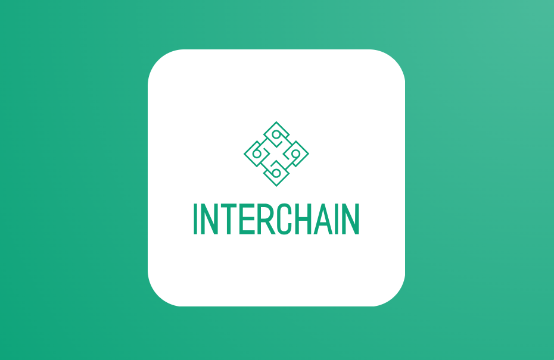

# InterChain 
This is a blockchain interoperability system design to connect multiple chains.

This is a relayer service which can connect multiple blockchains.

### NOTE:
Currently this is build in a event-driven mechanism to transfer messages between 2 select blockchains(ethereum and arbitrum). 
Shall be improved to transfer the native cryptocurrencies shortly.